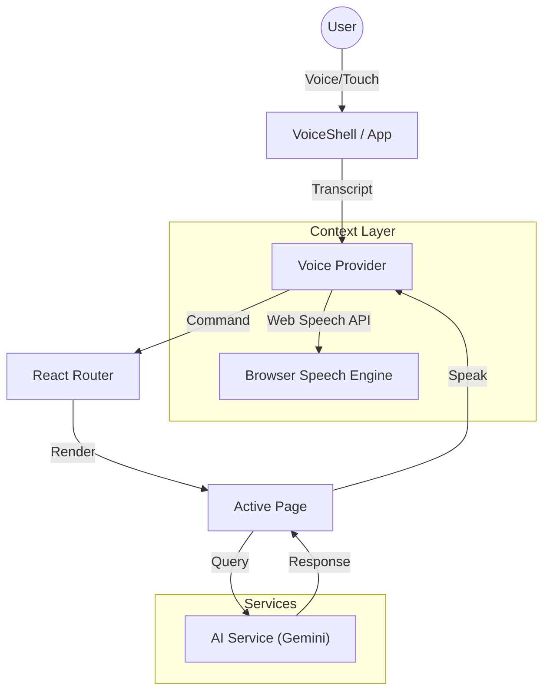

# JanSeva AI - Proposed System Design
>
> **Status:** Planning Phase | **Version:** Draft 1.0

## 1. System Architecture

### 1.1. Proposed Technology Stack

- **Frontend Framework**: React 19 (or latest stable) with TypeScript.
- **Build Tool**: Vite (for rapid development).
- **Styling**: Tailwind CSS (Utility-first) + Custom CSS Variables.
- **Animations**: Framer Motion (for smooth transitions).
- **Icons**: Lucide React.
- **AI Service**: Google Gemini API via `@google/generative-ai`.
- **PWA Support**: `vite-plugin-pwa` for offline capabilities.

### 1.2. Architecture Diagram (Conceptual)

## 2. Component Design (Draft)

### 2.1. Core Components

- **Voice Provider Component**: The central nervous system of the app. It will manage:
  - Listen triggers (Web Speech API).
  - Speech synthesis triggers (TTS).
  - Global transcript state.
- **Voice Shell Wrapper**: A layout wrapper containing the permanent "Mic" button and visualizers.
- **App Router**: Handles global command routing (e.g., specific keywords like "Jobs" trigger navigation).

### 2.2. Proposed Page Modules

- **Dashboard**: Grid layout entry point.
- **Jobs / Schemes / Community**: Listing views.
- **Advisory**: Conversational interface integrated with AI.

## 3. Data Flow & AI Integration Strategy

### 3.1. Voice Command Flow

1. User interacts with mic -> System starts listening.
2. Resulting text is stored in ephemeral state.
3. Router watches for keywords in the transcript.
4. Navigation occurs upon match.
5. Transcript is cleared to prevent double-firing.

### 3.2. Contextual AI

- **Service Layer**: An abstraction over the Gemini API.
- **Resolution Strategy**:
  - **API Available**: Query Gemini with context-specific system prompts.
  - **Offline/Error**: Fallback to local heuristic responses to ensure user confidence.

## 4. UI/UX Design System Proposal

### 4.1. Visual Theme

- **Glassmorphism**: Translucent cards against dark gradients.
- **Color Coding**: Semantic colors for modules (Blue=Jobs, Green=Schemes).
- **Typography**: Clean, sans-serif fonts supporting Hindi scripts.

### 4.2. Interaction Design

- **Micro-interactions**: Scaling and haptic-like visual feedback.
- **Transitions**: Smooth page fades.
- **Visual Feedback**: Pulse animations for listening states.

## 5. Security & Privacy

- **Permissions**: Microphone access requested on-demand.
- **Key Management**: Environment variable usage for API keys.
